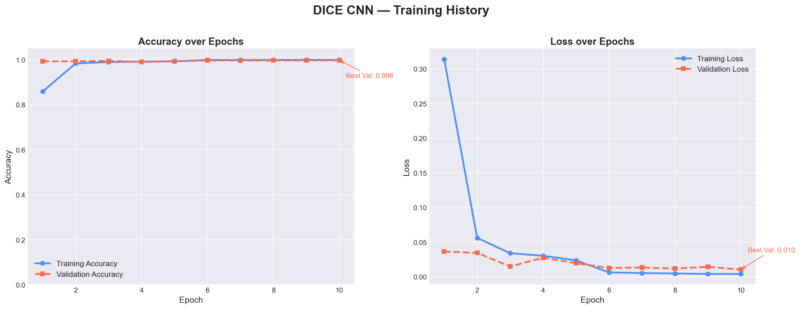
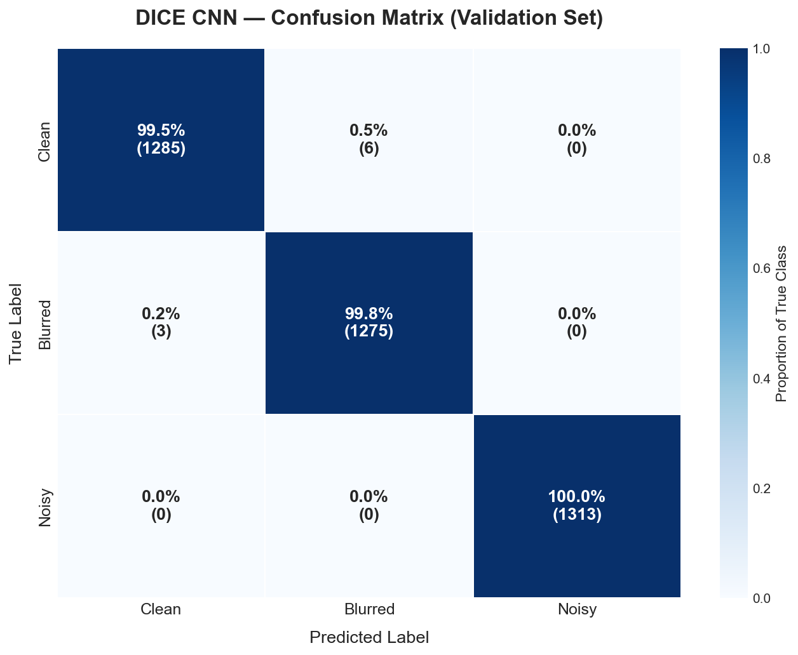

# DICE — Degradation & Image Classification Engine


---

## Abstract

**DICE** (Degradation & Image Classification Engine) is a No-Reference Image Quality Assessment (NR-IQA) system designed for aerial UAV imagery. Unlike traditional full-reference metrics (e.g., PSNR, SSIM) that require a pristine reference image for comparison, DICE operates solely on the input image — a critical capability for autonomous UAV platforms where reference frames are unavailable in real-world deployment.

The system addresses a fundamental challenge in autonomous perception: **sensor and optics degradation directly impairs the downstream performance of object detection, tracking, and semantic segmentation modules**. By classifying incoming frames into quality tiers (Clean, Blurred, or Noisy) at inference time, DICE provides a lightweight preprocessing gate that can trigger adaptive processing pipelines — such as deblurring or denoising — before safety-critical perception tasks are executed.

The model was trained and validated on the **VisDrone 2019 DET Benchmark Dataset**, a large-scale, academically rigorous collection of high-resolution aerial imagery captured across 14 different Chinese cities under diverse environmental conditions. A custom synthetic degradation pipeline was constructed using OpenCV to simulate real-world optics and sensor failure modes.

---

## Table of Contents

- [Data Pipeline](#data-pipeline)
- [Sample Data](#sample-data)
- [Model Architecture](#model-architecture)
- [Results](#results)
- [Repository Structure](#repository-structure)
- [How to Reproduce](#how-to-reproduce)
- [Dataset Citation](#dataset-citation)

---

## Data Pipeline

The training dataset was constructed via a three-class synthetic degradation pipeline applied to the raw VisDrone imagery using **OpenCV (`cv2`)** and **NumPy**. This approach is grounded in real-world UAV failure modes:

| Class | Folder | Degradation Method | Real-World Analog |
|---|---|---|---|
| **0 — Clean** | `Class_0_Clean/` | None (direct copy) | Nominal optics, good lighting |
| **1 — Blurred** | `Class_1_Blurred/` | Gaussian Blur (kernel 15×15, σ=auto) | Lens defocus, fast motion |
| **2 — Noisy** | `Class_2_Noisy/` | Additive Gaussian Noise (μ=0, σ=25) | Sensor thermal noise, low-light ISO |

**Degradation Mechanics:**

- **Gaussian Blur** is modelled as a convolution with a 2D Gaussian kernel of size 15×15. Each output pixel becomes a weighted average of its neighbourhood, approximating the optical Point Spread Function (PSF) of a defocused or motion-blurred lens.

- **Gaussian Noise** is implemented as Additive White Gaussian Noise (AWGN): random values sampled from `N(μ=0, σ=25)` are added to each pixel channel in float32 space, then clipped to `[0, 255]` and cast back to `uint8`. This faithfully models electronic sensor noise arising from thermal agitation and photon shot noise at elevated ISO values.

The `dice_data_generator.py` script processed **6,471 source images**, producing a final dataset of **19,413 images** (6,471 per class) with a `tqdm` progress bar for monitoring. An 80/20 stratified split was used for training and validation via `tf.keras.utils.image_dataset_from_directory`.

---

## Sample Data

A small representative subset of the pipeline output is included in `sample_data/` for immediate visual inspection, without requiring the full ~1.44 GB VisDrone download.

```
sample_data/
├── originals/          ← Raw VisDrone source frames
├── Class_0_Clean/      ← Direct copies (baseline)
├── Class_1_Blurred/    ← Gaussian Blur applied
└── Class_2_Noisy/      ← Gaussian Noise applied
```

These samples demonstrate the degradation pipeline's output and confirm that the script runs correctly on any set of input `.jpg` images.

---

## Model Architecture

A custom **3-Block Convolutional Neural Network** was implemented using the **TensorFlow/Keras Sequential API**. The architecture was deliberately designed to be interpretable and free of transfer-learning dependencies, demonstrating learned feature hierarchies from scratch on domain-specific UAV imagery.

```
Input: (256 × 256 × 3) RGB image
│
├── Rescaling(1/255)                        ← Pixel normalisation [0, 1]
│
├── [Block 1]  Conv2D(32, 3×3, ReLU) × 2
│              MaxPooling2D(2×2)             → (128 × 128 × 32)
│              Dropout(0.25)
│
├── [Block 2]  Conv2D(64, 3×3, ReLU) × 2
│              MaxPooling2D(2×2)             → (64 × 64 × 64)
│              Dropout(0.25)
│
├── [Block 3]  Conv2D(128, 3×3, ReLU) × 2
│              MaxPooling2D(2×2)             → (32 × 32 × 128)
│              Dropout(0.25)
│
├── Flatten                                 → (131,072,)
├── Dense(256, ReLU)
├── Dropout(0.50)
└── Dense(3)                                ← Logits for 3 classes
```

**Design rationale:**

- **Doubling filter depth per block** (32 → 64 → 128) is the standard VGGNet convention: as spatial resolution halves via MaxPooling, representational capacity is maintained by doubling the number of feature maps.
- **Dual Conv2D per block** allows the network to compose two successive non-linear transformations before downsampling, increasing effective receptive field depth.
- **Dropout regularisation** (0.25 in conv blocks, 0.50 before the output head) prevents co-adaptation of feature detectors and acts as an implicit ensemble of sub-networks.
- **`from_logits=True`** in `SparseCategoricalCrossentropy` defers the Softmax to the loss function, exploiting the numerically stable log-sum-exp formulation.

Training was managed with **EarlyStopping** (patience=3, restoring best weights) and **ReduceLROnPlateau** (factor=0.2, patience=2), using the **Adam** optimiser at its default learning rate of 0.001.

---

## Results

The model converged rapidly and achieved near-perfect separation of the three quality classes, consistent with the high discriminability of the synthetic degradation modes.

| Metric | Value |
|---|---|
| **Validation Accuracy** | **99.77%** |
| **Validation Loss** | **0.0103** |
| Optimiser | Adam (lr=0.001) |
| Image Size | 256 × 256 px |
| Batch Size | 32 |

### Training History



*Figure 1: Training and validation accuracy (left) and cross-entropy loss (right) over training epochs. The tight tracking of training and validation curves confirms the absence of significant overfitting.*

### Confusion Matrix



*Figure 2: Normalised confusion matrix evaluated on the held-out validation set (3,883 images). The near-perfect diagonal confirms high per-class precision and recall, with negligible inter-class confusion.*

---

## Repository Structure

```
Degradation & Image Classification Engine/
│
├── dice_data_generator.py          ← OpenCV synthetic degradation pipeline
├── DICE_Classifier.ipynb           ← CNN architecture, training & evaluation notebook
├── dice_model.keras                ← Saved trained model (TF/Keras native format)
│
├── confusion_matrix.png            ← Per-class evaluation heatmap (from Cell 4)
├── training_history.png            ← Accuracy & loss curves (from Cell 4)
│
├── sample_data/                    ← Small VisDrone subset for pipeline demonstration
│   ├── originals/
│   ├── Class_0_Clean/
│   ├── Class_1_Blurred/
│   └── Class_2_Noisy/
│
├── .gitignore                      ← Excludes raw data, venv, __pycache__, etc.
└── README.md                       ← This file
```

> **Note:** The full `VisDrone_Clean/` source folder (~1.44 GB) and the three generated `dataset/Class_*/` folders are excluded from version control via `.gitignore`. See [How to Reproduce](#how-to-reproduce) for instructions on regenerating the full dataset locally.

---

## How to Reproduce

Follow these steps to reproduce the full training pipeline from scratch.

### 1. Clone the Repository

```bash
git clone https://github.com/<your-username>/DICE.git
cd DICE
```

### 2. Set Up the Environment

```bash
python -m venv .venv

# Windows
.venv\Scripts\activate

# macOS / Linux
source .venv/bin/activate

pip install tensorflow opencv-python numpy tqdm matplotlib seaborn scikit-learn jupyterlab
```

### 3. Download the VisDrone Dataset

Download the **VisDrone2019-DET-train** split from the official repository:

> **[VisDrone Dataset — Official GitHub Repository](https://github.com/VisDrone/VisDrone-Dataset)**

Extract the raw `.jpg` images and place them in a folder named `VisDrone_Clean/` at the repository root:

```
DICE/
└── VisDrone_Clean/
    ├── 0000001_00000_d_0000001.jpg
    ├── 0000001_00000_d_0000002.jpg
    └── ...
```

### 4. Generate the Synthetic Dataset

```bash
python dice_data_generator.py
```

This will create the `dataset/` directory with the three class sub-folders (approx. 19,413 images total). A `tqdm` progress bar will display the processing status.

### 5. Train the CNN

Launch JupyterLab and run all cells in sequence:

```bash
jupyter lab DICE_Classifier.ipynb
```

The notebook will:
1. Load and split the dataset (80/20)
2. Build and summarise the CNN architecture
3. Train with EarlyStopping and ReduceLROnPlateau callbacks
4. Generate and save `training_history.png` and `confusion_matrix.png`
5. Save the trained model to `dice_model.keras`

---

## Dataset Citation

This project utilises the **VisDrone 2019 DET Benchmark Dataset**, specifically the `VisDrone2019-DET-train` split, consisting of high-resolution aerial UAV imagery captured across diverse urban environments. The raw data is **not hosted in this repository** due to GitHub file-size constraints (~1.44 GB).

Official repository and citation:
> Zhu, P., Wen, L., Du, D., Bian, X., Fan, H., Hu, Q., & Ling, H. (2021). **Detection and Tracking Meet Drones Challenge**. *IEEE Transactions on Pattern Analysis and Machine Intelligence (TPAMI)*, 44(11), 7380–7399. https://doi.org/10.1109/TPAMI.2021.3119563

```bibtex
@article{zhu2021detection,
  title     = {Detection and Tracking Meet Drones Challenge},
  author    = {Zhu, Pengfei and Wen, Longyin and Du, Dawei and Bian, Xiao and
               Fan, Heng and Hu, Qinghua and Ling, Haibin},
  journal   = {IEEE Transactions on Pattern Analysis and Machine Intelligence},
  volume    = {44},
  number    = {11},
  pages     = {7380--7399},
  year      = {2021},
  publisher = {IEEE},
  doi       = {10.1109/TPAMI.2021.3119563}
}
```

---

<p align="center">
  Built as part of an independent research project in Computer Vision & Autonomous Systems.<br>
  <em>Aniket Kumar — 2026</em>
</p>
